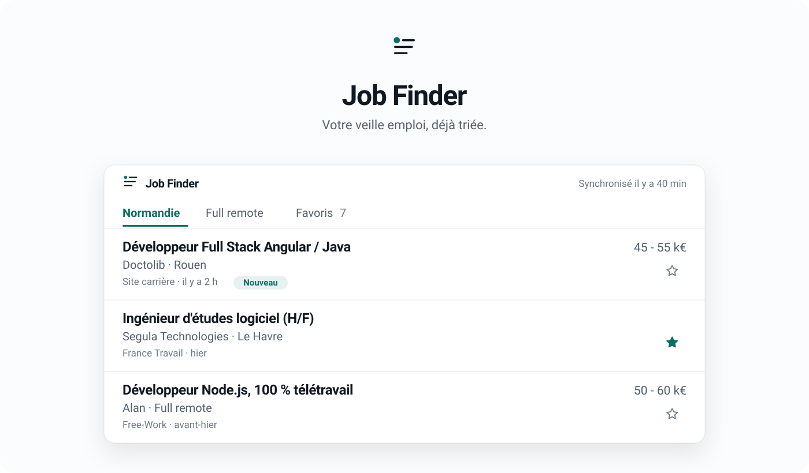
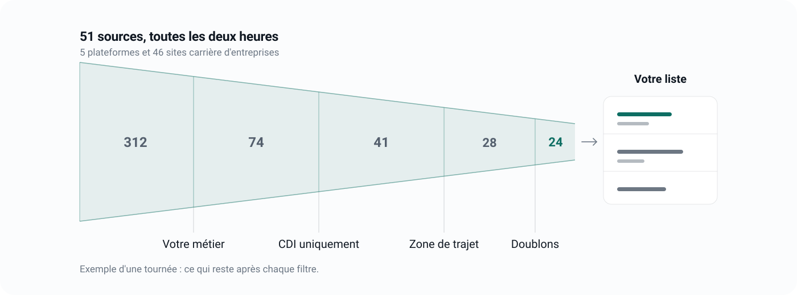
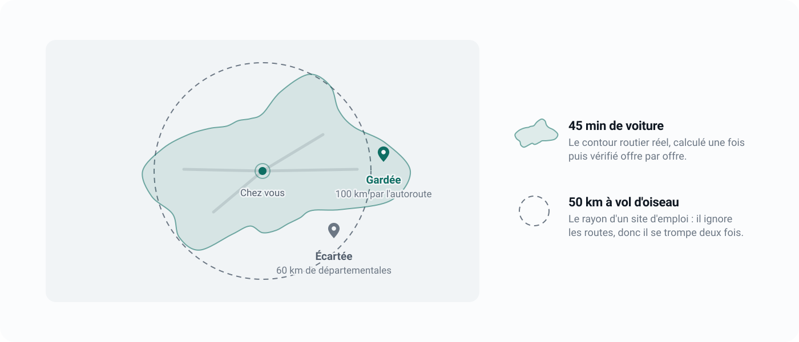
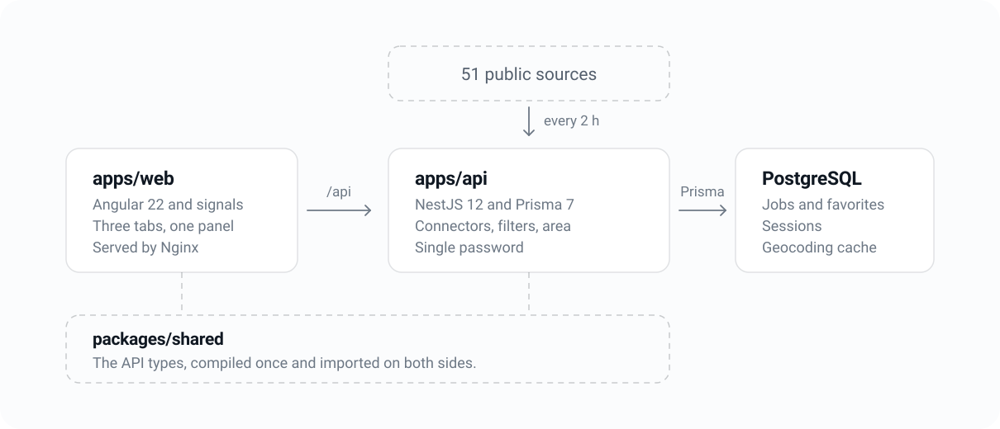

<p align="center">
  
</p>

<p align="center">
  <b>A job aggregator for one person: you.</b><br />
  Permanent contracts only, your job only, only where you are willing to commute.<br />
  No search form, no filters to tick again, no email alerts to sort through.
</p>

<br />

## The problem

Looking for a job means doing the same round every single day. France Travail in the morning,
Adzuna at noon, APEC in the evening, Free-Work when you remember it, and the "Careers" pages of
the companies you would actually like to join. Every time: retype the job title, tick permanent
again, narrow the area again, scroll past yesterday's listings, stumble three times on the same
offer republished by three platforms, and lose the one you had spotted the day before.

An hour a day of handling, for three genuinely new offers.

## The round is done before you get there



Job Finder queries fifty-one sources every two hours and keeps only what concerns you. An offer
published on three platforms shows up once: the most complete version is kept, the links to each
one are gathered on the same row. An offer pulled from the sites disappears from the list. Your
favorites stay.

## Three tabs, nothing else

<p>
  
  <b> Your area</b><br />
  The jobs actually reachable from home, measured in driving time.
</p>

<p>
  
  <b> Full remote</b><br />
  The one hundred percent remote jobs, wherever they are.
</p>

<p>
  
  <b> Favorites</b><br />
  What you have set aside. Protected, never purged.
</p>

On every row: the **New** badge on whatever arrived since your last visit, a star to keep it, a
cross to never see the listing again. One click opens the detail next to the list without making
it disappear; a second one sends you to the original listing to apply.

## A commute area, not a radius



The area is a real driving-time contour, computed once then checked offer by offer. A job 100 km
away by motorway gets in, a job 60 km away on back roads does not. When the source does not give
the town, the offer is kept and flagged rather than dropped in silence.

## What sets it apart

<p>
  
  <b> The sorting is strict</b><br />
  Apprenticeships, internships, freelance missions and "business developer" roles never make it
  through the door. Neither does a listing that mentions no technology from your stack.
</p>

<p>
  
  <b> Nothing moves without you</b><br />
  No automatic applications, no message sent on your behalf, no profile dropped anywhere. The app
  reads public listings and presents them to you.
</p>

<p>
  
  <b> It is yours</b><br />
  The app runs on your machine or your server, behind a single password. Your favorites, your
  hidden offers and your history never leave your database. No tracker is loaded, no data is
  resold.
</p>

<p>
  
  <b> It adapts to you</b><br />
  The job title, the keywords, the technologies, the reference town and the commute time all fit
  in one configuration page. Angular developer in Le Havre today, sales engineer in Nantes
  tomorrow: same app, one file edited.
</p>

## A typical day

| | |
|---|---|
| **8:02** | You open the app from the icon on your home screen. |
| **8:03** | Four offers flagged New. Two do not speak to you: cross, cross. |
| **8:05** | A third one interests you: star. You apply to the fourth. |
| **8:06** | Done. The day's watch is over. |

## The sources covered

France Travail, Adzuna, APEC, EURES, Free-Work, and 46 company careers sites queried directly
(Doctolib, Dataiku, Mirakl, Algolia, Alan, Qonto, Swile and the others). A source that is
unavailable or not configured is simply skipped: the others keep filling the list.

## Where it lives

Installed on a server, it opens from any browser, on desktop as well as on a phone. Added to the
home screen, it behaves like a native app: full screen, its own icon, light or dark theme
following your system.

It speaks French and English. It opens in whichever of the two your browser asks for, and the
button in the header switches it at any time, including before the password screen.

<br />

---

<br />

# Technical documentation



npm workspaces monorepo, Node 22 or later.

| Workspace | Contents |
|---|---|
| `apps/api` | NestJS 12, Prisma 7, PostgreSQL |
| `apps/web` | Angular 22, standalone, signals |
| `packages/shared` | The API types shared by both (`@job-finder/shared`) |

`packages/shared` is consumed compiled: `npm run build -w @job-finder/shared` must have run at
least once before the first `npm run dev`.

## Getting started

PostgreSQL on the machine, no Docker in development.

```bash
cp .env.example .env   # API keys and search profile
npm install
npm run setup          # build shared, create the role and the database, run migrations
npm run dev            # api on :3001, web on :4201
curl -X POST http://localhost:3001/api/ingestion/run   # the database starts out empty
```

## The commands

```bash
npm run build                        # shared, then api, then web
npm test                             # api tests (vitest)
npm run test -w web                  # front-end tests
npm run lint                         # oxlint on the api
npm run db:migrate                   # migrations, then Prisma client regeneration
npm run db:studio                    # Prisma Studio
npm run geo:isochrone                # regenerates the area from the .env
npm run auth:set-password -- <pwd>   # --clear to remove the password
```

## How it works

**The whole domain lives in the `.env`**: job title, keywords, stack, area. The file is validated
by zod and exposed as an injectable `SearchProfile`. Changing job requires no code.

**The sources** (`apps/api/src/sources/`) share one contract: `name`, `isEnabled()`,
`fetchJobs(): Promise<RawJob[]>`. Missing keys, source skipped, not failed. The 46 ATS boards go
through a single connector iterating `sources/ats/companies.config.ts`.

**Ingestion** (`ingestion/ingestion.service.ts`) runs on a cron and on
`POST /api/ingestion/run`: filters (title, stack, permanent contract, remote, area), then an
upsert on `(source, sourceId)` with cross-source duplicate merging via a `dedupeHash` (title,
company, location), then a purge of offers not seen for thirty days, favorites excluded.

**The commute area** is an isochrone polygon generated once by OpenRouteService and committed
(`geo/isochrone.geojson`): at ingestion time, a plain point-in-polygon, no network call.
Geocoding is cached in the database, failures included.

**Authentication** relies on a single shared password, hashed with scrypt, with a session token
in the `x-app-token` header. With no password in the database, the api lets everything through in
development and answers 503 in production.

**The wording** lives in one dictionary per language (`core/i18n/`), French setting the shape
the others must match. `I18n` exposes it as a signal, so switching language re-renders the whole
UI without a reload; the choice is kept in `localStorage`, and the browser decides on a first
visit.

**The front end** keeps `job-list` mounted at all times; `job-detail` is a child route rendered in
its `<router-outlet>`, a column or a sheet depending on the width, decided in CSS. Changes made in
the panel travel back to the list through `JobPatchBus` rather than through a reload.

## Routes

| Route | |
|---|---|
| `GET /api/config` | Local tab label, whether a password is set (public) |
| `POST /api/auth/login` | Returns a session token (public, 5 attempts per 15 min) |
| `GET /api/jobs?tab=local\|remote\|favorites` | List, counts, last ingestion |
| `GET /api/jobs/:id` | Detail, marks the offer as viewed |
| `PATCH /api/jobs/:id/favorite` and `/hide` | Favorite, hiding |
| `POST /api/ingestion/run` | Manual ingestion |
| `GET /api/ingestion/status` | State per source |
| `GET /api/health` | Api and database (public) |

## Deployment

`docker-compose.yml` only serves the deployed setup: Nginx serves the Angular build and proxies
`/api`. Migrations and the first ingestion run when the api container starts.

```bash
cp .env.example .env   # + a real POSTGRES_PASSWORD, CORS_ORIGIN = public https URL
docker compose up -d --build
docker compose exec api npm run auth:set-password -- "<password>"
```

Only `127.0.0.1:8480` is published: a reverse proxy on the host terminates TLS, for example with
Caddy (`jobs.example.com { reverse_proxy 127.0.0.1:8480 }`). With Nginx, set `X-Forwarded-For`:
login attempt throttling depends on that header.

Set `INGESTION_ON_STARTUP=false` again afterwards so a full ingestion is not replayed on every
restart. Update: `git pull && docker compose up -d --build`.
